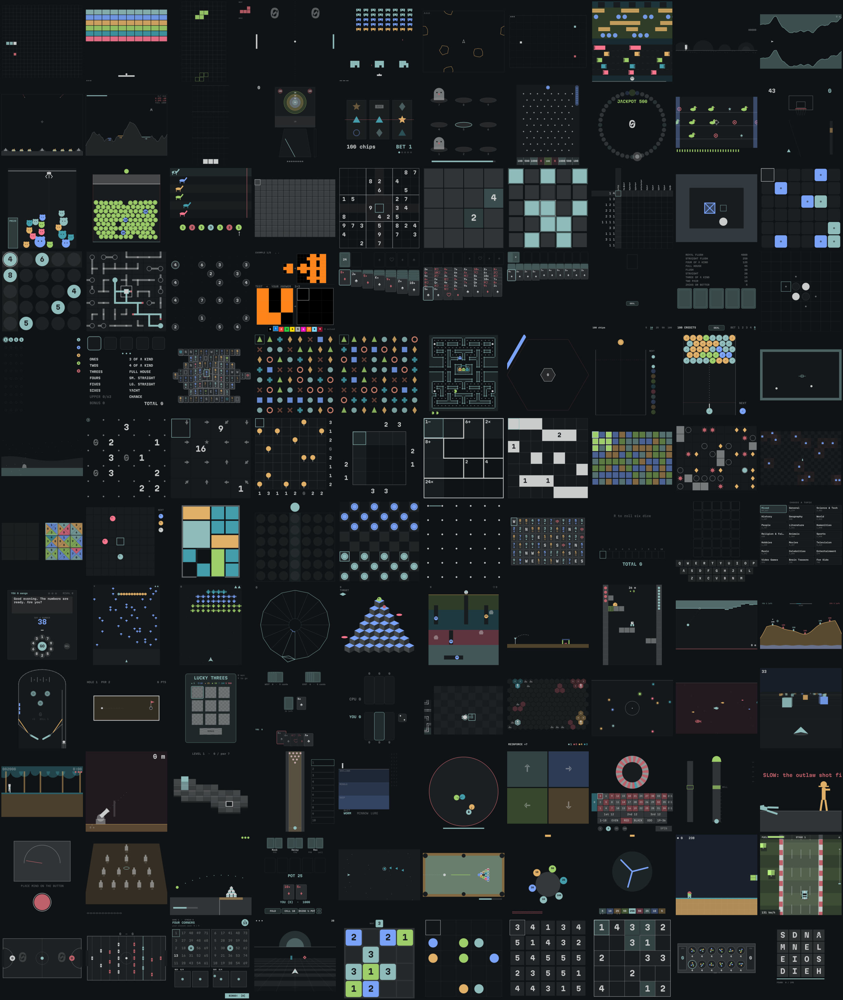

# Nickelbar

One hundred and twenty small games as one [Omarchy](https://omarchy.org) shell plugin: a
gamepad icon in the bar opens a picker, and games play in a centred
overlay. Every colour comes from the active theme, so a theme switch
repaints the lot. Everything plays with the keyboard, and with the mouse.

Nickelbar is an independent, unofficial plugin: it is not made, endorsed or
supported by the Omarchy project.



## The games

- Arcade: Snake, Bricks (after Breakout), Blockfall, Paddles (after Pong), Invaders, Rockfall (after Asteroids), Light
  Cycles, Crossing, Runner, Cave Flyer, Skyguard (after Missile Command), Moon Lander (after Lunar Lander),
  Muncher (a maze chase after Pac-Man, on an original maze), Hexfall
  (after Hextris), Melon Drop (after the Suika game), Bubble Pop (after
  Frozen Bubble), Road Rally (a top-down race against a fuel gauge, after Road Fighter), Sunlane (after Space Harrier: a rail shooter over a chequered plain), Jungle Run (after Pitfall!), Stomper (a run-and-jump platformer with endless generated levels), Bumper Cars, Quick Draw (a western showdown), Raid (a side-scrolling shooter), Bounce (after KBounce), Moon Buggy (after
  the terminal game), Crawler (after Centipede), Swarm (after Galaga), Vortex (after Tempest), Cube Hop
  (after Q*bert), Digger (after Dig Dug), Catapult (after Angry Birds),
  Deep Well (after Downwell), Grapple (after Floating Point), Artillery
  (after Worms), and after Flash-era favourites: Chain Burst (Boomshine),
  Big Fish (Fishy), Cube Run (Cube Field), Kitty Launch (Kitten Cannon /
  Toss the Turtle)
- Midway: Stacker, Alley Roll (after Skee-Ball), Slots, Mole Mash (after Whac-A-Mole), Chip Drop (after Plinko), Cyclone,
  Shooting Gallery, Hoops, Claw Machine, Coin Pusher, Derby, Pinball, Mini Golf, Scratch Cards, Air Hockey, Foosball, Bingo (two cards each against two computer players; the score is your win streak), Bowling (ten frames, with a real
  pin-and-ball physics run), Fishing, Roulette, High Striker, Ring Toss, Milk Jugs, Newton's Apples, Tornado
- Puzzle: Minesweeper, 2048, Switch Off (after Lights Out), Sokoban, ARC (all of ARC-AGI-1:
  work out the rule from the examples and paint the answer; the one game
  that keeps its own colours, since ARC's ten carry meaning), and after
  open-source Linux games: Robots, Tetravex, Five or More, Klotski;
  Echo (a Simon-style pattern game on four pads or eight notes), Pipeline (after Pipe Mania), Roll Block (after Bloxorz), Triples (after Threes), Numberlink (after Flow Free)
- Logic (pen and paper): Sudoku, Nonogram, Binary Grid and Sightlines (after Q42's
  0h h1 and 0h n0), and after Simon Tatham's collection: Net, Bridges, Loopy,
  Signpost, Tents, Towers, Keen, Light Up, Same Game, Inertia; and after Nikoli's
  pencil puzzles, Hitori and Fillomino
- Cards: Klondike, FreeCell, Spider (1/2/4 suits), Blackjack, Video Poker
  (Jacks or Better), Crazy Eights, Texas Hold'em (against three bots)
- Board: Reversi, Codebreaker, Yacht, Mahjong (the turtle; every deal can
  be cleared), Zen Geometry and Geometry Classic (the same board with
  Bejeweled's rules), Four in a Row, Checkers, Dots and Boxes (after
  KSquares), Shisen-Sho (after KShisen; every deal is checked to be
  clearable), Greed (a push-your-luck dice game, ten turns), Knucklebones (after Cult of
  the Lamb), Empire (after Empire Attack, on hexes), Mancala (Kalah rules,
  against an alpha-beta computer), Billiards (eight-ball against the computer)
- Quiz: Mind Tester (a joke machine), Trivia (multiple choice, about 49,000 questions over twenty
  topics plus Mixed; answer until three strikes. Each topic deals from
  its own shuffled deck, so nothing repeats until you've been through the
  whole topic), Five Letters (after Wordle; score is your win streak), Word Hunt (after Boggle: three
  minutes to trace words through a 4x4 letter grid), Wangernumb (a joke
  after That Mitchell and Webb Look: type numbers at a game show with a
  hidden, ever-changing rule; the board turns and the number wheel
  reshuffles, but only inside the overlay)

Behind a few of them:

- The logic puzzles (except Fillomino, below) are all solvable by deduction, never needing a guess:
  each generator checks its puzzles with a solver limited to the
  reasoning a person does (row-by-row for Binary Grid and Nonogram; singles,
  locked candidates and pairs for Sudoku; at most "try this and see it
  break at once" for the rest), which also makes the answer unique.
- Hitori is generated the same way: a puzzle is kept only if the human-style solver finishes it. Fillomino
  puzzles are checked to have exactly one solution by exhaustive search, and given extra clues so they
  read as deduction, but that isn't proof that no puzzle ever needs a look-ahead.
- The pen-and-paper puzzles after Simon Tatham's collection (Loopy,
  Signpost, Tents, Towers, Keen, Light Up) play from prebuilt packs in
  `games/data/tatham/`.
- Numberlink puzzles are made by cutting one path that visits every square, so a full solution always
  exists (there may be several). Mancala is Kalah; its computer searches eight moves deep.
- Word Hunt's dictionary is ENABLE (public domain) minus a short blocklist; boards are dealt only if
  they hold at least sixty words.
- Klotski's levels are generated and solved by breadth-first search, and
  Roll Block's are hand-made and solver-checked, so each has a par.
- Mahjong and Shisen-Sho only deal layouts that can be cleared.
- Blockfall is the falling-piece game; its id is still `stack`, so older
  scores and saves carry over.

## Requirements

- Omarchy with the shell plugin system (`omarchy plugin ...`), which runs
  on Quickshell (`qs`).
- `make` and `rsync` to install from a checkout.
- For development only: Node.js (tests and data tools), ImageMagick
  (`make screenshots`), Python 3 with `wordfreq` (rebuilding the word list).

## Install

From a checkout of this repository:

```
make install    # copy into ~/.config/omarchy/plugins/io.github.cobmuddybug.nickelbar
make enable     # validate it and turn it on (adds the bar widget)
```

Or, in one step from the repository's git URL (the repository root is the
plugin folder):

```
omarchy plugin add <git-url> --enable
```

After pulling changes, `make install` again. Most changes hot-reload;
because the plugin stays loaded, some only show up after `make restart`
(`omarchy restart shell`).

## Remove

```
omarchy plugin remove io.github.cobmuddybug.nickelbar
```

From a checkout, `make disable` turns it off and `make uninstall` deletes
`~/.config/omarchy/plugins/io.github.cobmuddybug.nickelbar`.

Scores, saves, favourites and recents live in `$XDG_DATA_HOME/nickelbar/`
(usually `~/.local/share/nickelbar/`); delete that too for a clean slate.

## Using it

- Left click the gamepad icon: picker. Games are grouped: Continue
  (rounds you left half-played), Recent, Favourites, then each category.
  Arrows move, `[` `]` jump between sections (or click the tabs),
  Home/End go to the ends, `*` favourites the selected game, enter plays.
  Just start typing to search: fuzzy on titles ("lc" → Light Cycles)
  plus aliases ("solitaire", "draughts", "takuzu"; the tile shows which alias
  matched). 
  In the overlay (Tab from a game) a panel beside the list says what the
  selected game is, how long a round takes, whether it plays against the
  computer, your best, how many rounds you've played and won, and your
  progress in it. Chips above the list narrow it: Quick (three minutes or
  less), Versus (a computer opponent), New (added in the last 30 days) and
  Unplayed; `f` cycles them, and the tabs show each category's count.
- Daily challenge: the first section is today's game, one finite game
  picked by the date and dealt from a seed, so the board is the same all day
  (and the same for anyone else). It has its own save, doesn't touch your
  bests, and finishing it keeps a daily streak (`'{"daily":true}'` over IPC
  opens it directly).
- Tickets and prizes: a finished round pays tickets (Midway games by score,
  the rest a few, wins a bonus, the daily 20). The ★ Prizes chip opens the
  shelf, where they buy card backs (they show in every card game).
- Right click: resume whatever you played last.
- Middle click: deal a random game.
- In a game: arrows move, space/enter act, `n` new game, `p` pause,
  `u` undo (where the game supports it), Tab back to the game list, `h`
  (or `?`) help, Esc/`q` close. The help screen lists that game's own controls and
  rules, its mouse use, and its options: a difficulty (Easy / Normal / Hard,
  `Ctrl+D` cycles) for the games with a computer opponent or a ramp, and
  two players at one keyboard (`Ctrl+2`) for Paddles (right paddle on W/S),
  Four in a Row, Checkers and Reversi. Choices are remembered per game. The
  first time a game opens, the footer reminds you that `?` exists.
- Games can also take keys of their own: digits in Sudoku and Codebreaker,
  `f` flag in Minesweeper, `s`/`d` stand/double in Blackjack, 1-4 or a-d
  to answer and `t` for the topic list in Trivia, and so on.
  Each game's `?` help lists them.
- Every game also takes the mouse: grid games follow the pointer and act
  on a click (right-click for the second action: flag, cross, grass...),
  card games click or drag, paddles and turrets follow the pointer, and
  one-button games take a click. Each game's `?` help has a MOUSE line.
- Real-time games move for as long as a key is held. They also wait,
  paused, when you reopen the overlay.
- Best scores are saved the moment a round ends. Endless games (Zen
  Geometry, Slots, Blackjack, Video Poker) save theirs whenever the overlay closes.
- Sound: quiet synthesised blips (move, select, score, round over, pause)
  played by the overlay, so every game has them, plus sounds of their own
  in about twenty games (collisions, pots, pins, bells, notes...). `Ctrl+M`
  mutes; the choice is remembered. Regenerate the files with
  `node dev/tools/make-sounds.js`.
- Games that can't be resumed are the short ones: single rounds under a few
  minutes (Chip Drop, Hoops, Alley Roll...). Everything long (Billiards, Raid,
  Bumper Cars, Stomper's current level, the puzzles) saves on close.
- By IPC: `omarchy-shell shell toggle io.github.cobmuddybug.nickelbar '{"game":"snake"}'`
  (empty payload opens the picker or resumes the last game).

Example keybind, in `~/.config/hypr/bindings.lua`:

```lua
o.bind({ "SUPER" }, "G", "exec", "omarchy-shell shell toggle io.github.cobmuddybug.nickelbar '{}'")
```

## Development

Run one game in a window of its own, without the live shell (it uses a
stand-in theme from `dev/mock/`):

```
make dev              # snake
make dev GAME=2048    # any id from engine/GamesCatalog.js
```

Checks:

```
make test         # logic tests in Node, about a minute
make smoke        # every game in the real QML harness, a few minutes
make fuzz         # random keys, clicks and drags into every game; any QML error fails
make check        # all three
make test-slow    # also a brute-force Catapult search, about 30 s
```

`make test` runs `dev/tests/*.test.js`: the catalog and icons are
complete, every Roll Block level solves, Crazy Eights never loses a card
and always finishes, the Mini Golf holes can be holed, CPU-against-CPU
Artillery ends, the Cube Run slalom can be threaded, and the real-time
games run a simulated minute without NaNs. `make smoke` loads each game in
`dev/harness`, feeds it some input, round-trips its save, and fails on any
QML error. `node dev/tests/run.js rollblock` runs one file.

Other targets: `make screenshots` renders every game into
`docs/screenshots/` and tiles `gallery.png`; `make sync` regenerates the
dev harness's list of games from the catalog (the harness can't import
the catalog itself; `make test` fails if the two drift apart).

A headless screenshot of one game after scripted input (the step codes
are described at the top of `dev/harness/shell.qml`; `R` round-trips the
save):

```
dev/tools/harness-run.sh klondike "j,a,w,w" /tmp/klondike.png
```

### Adding a game

1. `games/logic/<name>.js`: the rules as a pure-JS `.pragma library`
   module. Most games keep an immutable state and return a new one from
   `step()` / move functions, which makes them easy to test in Node.
2. `games/<Name>.qml`: extends `engine/GameBase.qml`. Set `gameId`,
   `title`, `helpText`, `mouseHelp`; implement `newGame()`,
   `moveCursor()`, `activate()`, and optionally `pointer()`, `handleKey()`,
   `undo()`, `saveState()` / `loadState()`. Draw with colours from
   `engine/Theme.qml` only.
   Write `helpText` as segments separated by ` · `, key rows first
   (`ARROWS move · SPACE act · ...`), then rules: the help screen splits it
   into controls and notes (`engine/help.js`). For a computer opponent or a
   ramp, set `difficulties: ["Easy", "Normal", "Hard"]` and react in
   `onDifficultyChanged` (the overlay sets it before `newGame()`); for a
   hot-seat mode set `hasTwoPlayer: true` and react in `onPlayersChanged`.
   For sounds, a logic state can carry `ev` (names) and `evSeq` and the QML
   call `playEvents(state)`, or call `sound("name")` directly; set
   `ownSounds: true` if the game makes all its own. For undo in a turn-based
   game, `pushUndo(state)` before an action and `popUndo()` in `undo()`.
   Use `Rng.random()` (`.import "../../engine/Rng.js" as Rng`) rather than
   `Math.random()` so the daily challenge and tests can seed it; shared bits
   live in `games/logic/physics.js` (circle collisions) and `meter.js`
   (the swinging power meter).
3. Add it to `GAMES`, `BLURBS` and `META` (minutes, solo or vs CPU) in
   `engine/GamesCatalog.js`, draw an icon in `engine/icons.js`, run
   `make sync`, and bump the count in `manifest.json` and this README.
4. `make check`.

## Layout

```
manifest.json, BarWidget.qml, Picker.qml, Overlay.qml, GameList.qml
engine/    GameBase.qml, Theme.qml, Store.qml, GamesCatalog.js (+ blurbs),
           Pointer.qml (mouse: forwards to each game's pointer() hook),
           icons.js + GameIcon.qml (the picker's per-game icons),
           PackGame.qml + PuzzlePack.qml (games that play from a puzzle pack)
games/     <Name>.qml + logic/<name>.js, one pure-JS module per game
           (logic/cardart.js is the shared card drawing); data/ holds the
           puzzle packs, trivia, word list and ARC tasks
dev/       harness/ + mock/ for `make dev`; tests/ for `make test`;
           tools/ for the smoke test, screenshots, and rebuilding games/data
docs/      screenshots/gallery.png
```

## Data, licences and trademarks

Nickelbar's own code, drawings and sounds are MIT licensed (`LICENSE`). Four
data sets are other people's work under their own licences, with credits in
`THIRD_PARTY.md` and next to each file: ARC-AGI-1 (Apache 2.0), OpenTriviaQA
(CC BY-SA 4.0), ENABLE (public domain) and the Five Letters answer list
(selected with wordfreq's data, CC BY-SA 4.0). To rebuild the data:
`python3 dev/tools/trivia.py ~/OpenTriviaQA`,
`python3 dev/tools/words.py enable1.txt`, `node dev/tools/tatham/build.js
[game]` (Towers 6×6 takes a few minutes) and `node dev/tools/klotski.js`.

Many games are "after" classic games, as the list above says. They share
those games' ideas, never their code, art, music, levels or text, and they
draw in your theme's colours. All trademarks and game names mentioned belong
to their owners, and Nickelbar is not affiliated with or endorsed by any of
them. Omarchy and Quickshell are not bundled; the plugin runs on them.
